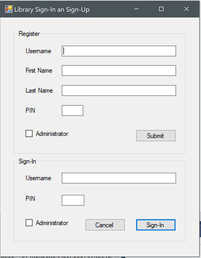
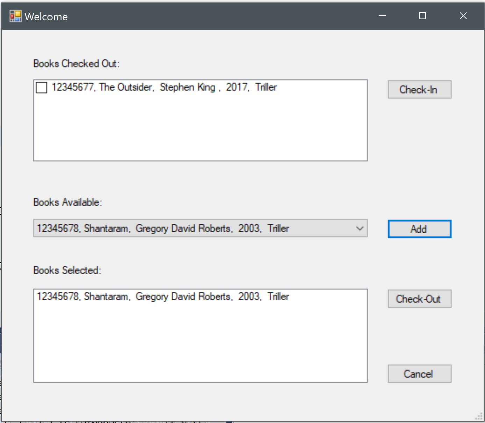
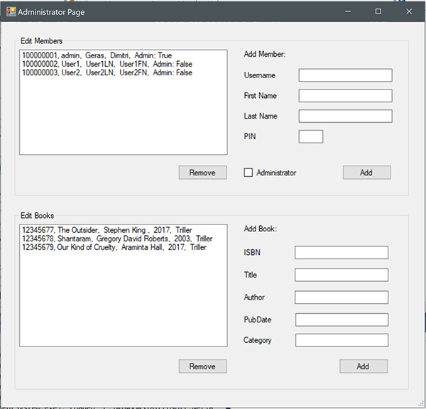

#### Sign-Up & Sign-in window:
When the app is launched the user can sign-up or sign-in. Administrator checkbox allows to open Administrator window.

---------------------------------------------------
#### User window:
The listbox allows customer to select available book and check it out, after that this book appears in BooksCheckedOut listbox. When the customer checks it in the selected book becomes available again.

-----------------------------------------------------
#### Administrator window:

Administrator can add and remove books and users from database.

